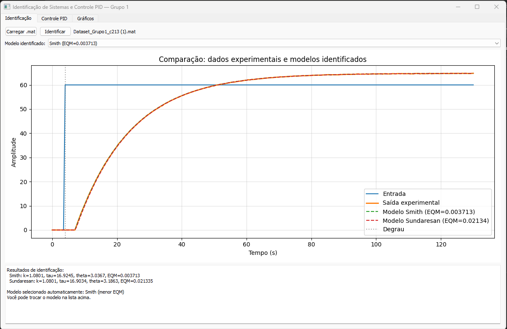
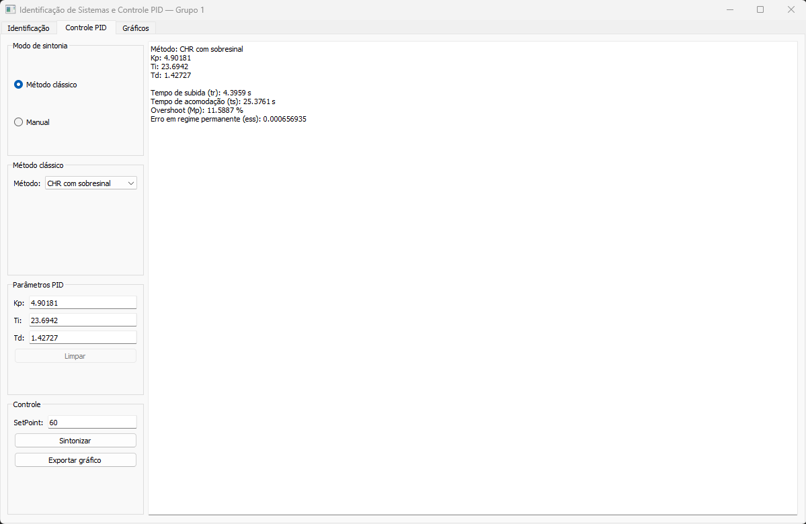
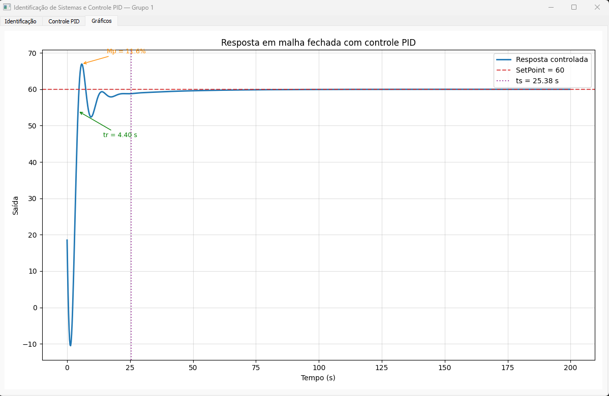
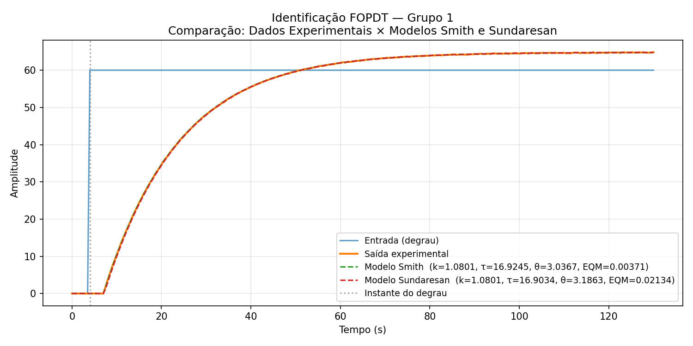
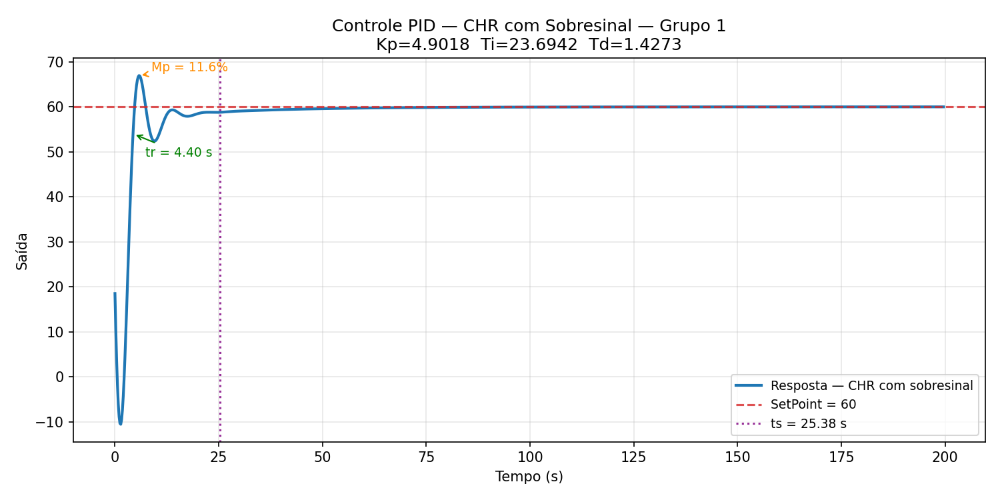
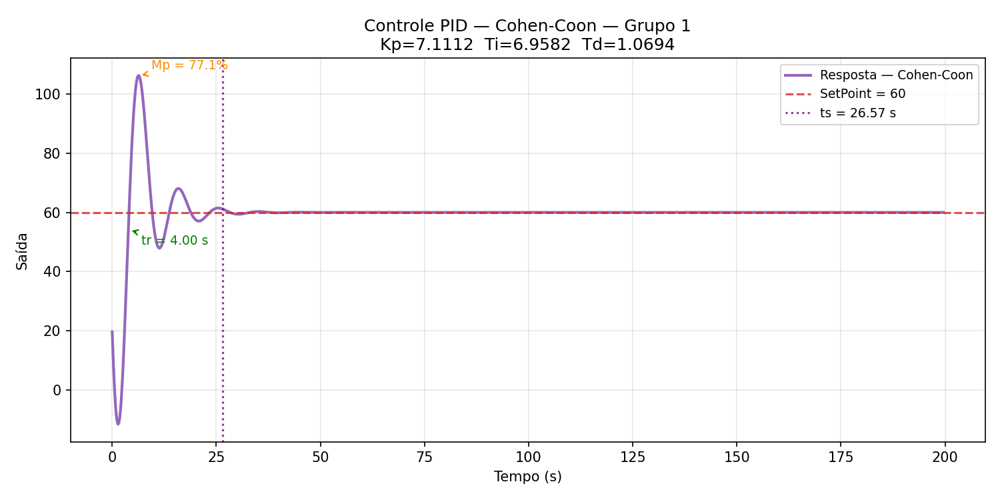
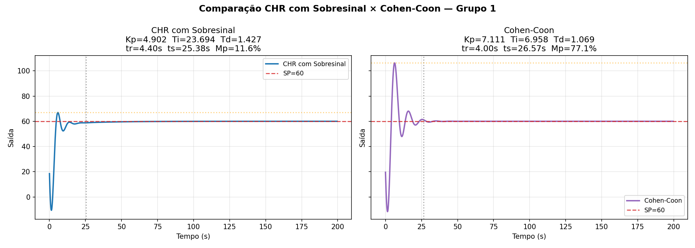

# Projeto C213 — Identificação de Sistemas e Controle PID

**Grupo 1** · Métodos: **CHR com Sobresinal + Cohen-Coon**  
Disciplina: Sistemas Embarcados — INATEL  

---

## Visão Geral

Aplicação desktop em Python com interface gráfica (PyQt5) para:

1. **Identificação FOPDT** de processos térmicos a partir de dados experimentais (`.mat`)
2. **Sintonia automática** de controladores PID pelos métodos CHR com sobresinal e Cohen-Coon
3. **Simulação** da resposta em malha fechada com marcadores de métricas
4. **Exportação** de gráficos e visualização interativa

---

## Sumário

- [Estrutura do Projeto](#estrutura-do-projeto)
- [Instalação](#instalação)
- [Como Executar](#como-executar)
- [Uso da Interface](#uso-da-interface)
- [Fundamentos Matemáticos](#fundamentos-matemáticos)
- [Resultados do Grupo 1](#resultados-do-grupo-1)
- [Arquitetura MVC](#arquitetura-mvc)
- [Testes Automatizados](#testes-automatizados)
- [Limitações e Melhorias Futuras](#limitações-e-melhorias-futuras)

---

## Estrutura do Projeto

```
.
├── .gitignore
├── README.md                            ← documentação principal (este arquivo)
├── Dataset_Grupo1_c213 (1).mat          ← dataset experimental do Grupo 1
│
├── assets/                              ← gráficos gerados dos resultados e prints da IHM
│   ├── identificacao_grupo1.png         ← resultado da identificação FOPDT
│   ├── controle_chr_grupo1.png          ← resposta CHR com sobresinal
│   ├── controle_cc_grupo1.png           ← resposta Cohen-Coon
│   ├── comparacao_metodos_grupo1.png    ← comparação dos dois métodos
│   ├── ihm_aba_identificacao.png        ← print da aba Identificação
│   ├── ihm_aba_controle.png             ← print da aba Controle PID
│   └── ihm_aba_graficos.png             ← print da aba Gráficos
│
├── tests/                               ← testes automatizados (pytest)
│   ├── conftest.py                      ← fixtures compartilhadas
│   ├── test_dataset.py
│   ├── test_identification.py
│   ├── test_tuning.py
│   ├── test_simulation.py
│   └── test_metrics.py
│
└── app/
    ├── main.py                          ← ponto de entrada da aplicação
    ├── requirements.txt                 ← dependências pip
    ├── controllers/
    │   └── main_controller.py           ← lógica de negócio / coordenação MVC
    ├── models/
    │   ├── dataset.py                   ← carregamento e validação do .mat
    │   ├── identification.py            ← Smith e Sundaresan (FOPDT)
    │   ├── tuning.py                    ← CHR com sobresinal e Cohen-Coon
    │   ├── simulation.py                ← simulação em malha fechada (Padé ord. 2)
    │   └── metrics.py                   ← tr, ts, Mp, ess
    └── views/
        └── main_window.py               ← interface PyQt5 (3 abas)
```

---

## Instalação

### Pré-requisitos

| Requisito | Versão mínima |
|-----------|--------------|
| Python    | 3.9          |
| pip       | atualizado   |

### Passo a passo

```bash
# 1. Clone o repositório
git clone https://github.com/PedroCB11/Projeto-de-Identificacao-de-Sistemas-e-Controle-PID-CHR-com-sobresinal-CC-.git
cd Projeto-de-Identificacao-de-Sistemas-e-Controle-PID-CHR-com-sobresinal-CC-

# 2. Crie e ative o ambiente virtual (recomendado)
python -m venv .venv

# Linux / macOS
source .venv/bin/activate

# Windows — PowerShell
.venv\Scripts\Activate.ps1

# Windows — Prompt de Comando
.venv\Scripts\activate.bat

# 3. Instale as dependências
pip install -r app/requirements.txt
```

### Dependências

| Pacote        | Versão | Uso                                      |
|---------------|--------|------------------------------------------|
| `numpy`       | ≥1.24  | Operações vetoriais e numéricas          |
| `scipy`       | ≥1.10  | Carregamento de arquivos `.mat`          |
| `matplotlib`  | ≥3.7   | Gráficos embarcados na interface         |
| `control`     | ≥0.9   | Funções de transferência e simulação     |
| `PyQt5`       | ≥5.15  | Interface gráfica                        |
| `pytest`      | ≥7.0   | Testes automatizados (desenvolvimento)   |

> **Windows:** Se ocorrer erro de DLL do Qt5, execute também:
> ```bash
> pip install pyqt5-tools
> ```

---

## Como Executar

```bash
# Com o ambiente virtual ativo, a partir da raiz do repositório:
python app/main.py
```

### Executar os testes

```bash
# Todos os testes (58 no total)
python -m pytest tests/ -v

# Apenas um módulo
python -m pytest tests/test_tuning.py -v

# Com relatório de cobertura (requer pytest-cov)
pip install pytest-cov
python -m pytest tests/ --cov=app/models --cov-report=term-missing
```

---

## Uso da Interface

### Aba 1 — Identificação

1. Clique em **Carregar .mat** e selecione o arquivo do dataset.
2. Clique em **Identificar** — os métodos Smith e Sundaresan são executados automaticamente. O gráfico exibe a saída experimental e os dois modelos sobrepostos, com o EQM de cada um na legenda.
3. O modelo com **menor EQM** é selecionado por padrão. Use a lista suspensa **"Modelo identificado"** para trocar manualmente entre Smith e Sundaresan antes de prosseguir.

### Aba 2 — Controle PID

| Modo | Comportamento |
|------|---------------|
| **Método clássico** | Selecione CHR com sobresinal ou Cohen-Coon. Os parâmetros Kp, Ti e Td são calculados automaticamente e exibidos nos campos (somente leitura neste modo). |
| **Manual** | Digite Kp, Ti e Td livremente. O botão **Limpar** zera os campos. A entrada é validada antes de simular. |

- Ajuste o **SetPoint** (padrão = amplitude do degrau do dataset).
- Clique em **Sintonizar** → a simulação em malha fechada é executada e:
  - A aba **Gráficos** exibe a resposta com marcadores visuais de **tr**, **ts** e **Mp**
  - O painel de métricas exibe os valores numéricos calculados
- Clique em **Exportar gráfico** para salvar como `.png` ou `.jpg`.

### Aba 3 — Gráficos

Exibe o gráfico da resposta em malha fechada com anotações interativas. A aba é ativada automaticamente após a sintonia.

---

## Fundamentos Matemáticos

### Modelo FOPDT

O modelo de Primeira Ordem com Atraso de Transporte (FOPDT) é:

```
         k · e^(−θ·s)
G(s) = ────────────────
           τ·s + 1
```

| Parâmetro | Símbolo | Descrição                          |
|-----------|---------|------------------------------------|
| Ganho     | k       | Relação entre Δsaída / Δentrada   |
| Constante de tempo | τ | Velocidade de resposta do processo |
| Atraso puro | θ    | Tempo morto / dead time            |

---

### Identificação FOPDT

#### Método de Smith

Utiliza os instantes em que a saída atinge **28,3 %** e **63,2 %** da variação total (Δy):

```
t₂₈ → y(t₂₈) = y₀ + 0,283 · Δy
t₆₃ → y(t₆₃) = y₀ + 0,632 · Δy

τ = 1,5 · (t₆₃ − t₂₈)
θ = t₆₃ − τ
k = Δy / Δu
```

#### Método de Sundaresan

Utiliza os instantes em que a saída atinge **35,3 %** e **85,3 %** da variação total:

```
t₃₅ → y(t₃₅) = y₀ + 0,353 · Δy
t₈₅ → y(t₈₅) = y₀ + 0,853 · Δy

τ = 0,67 · (t₈₅ − t₃₅)
θ = 1,3 · t₃₅ − 0,29 · t₈₅
k = Δy / Δu
```

O método com **menor EQM** (Erro Quadrático Médio) é selecionado por padrão:

```
EQM = (1/N) · Σ [y_experimental(tᵢ) − y_modelo(tᵢ)]²
```

---

### Sintonia PID

O controlador PID paralelo implementado é:

```
              ⎛    1          ⎞
C(s) = Kp · ⎜ ─────  +  1  +  Td · s ⎟
              ⎝  Ti·s         ⎠
```

#### CHR com 20 % de Sobresinal

Chien, Hrones e Reswick (1952) — seguimento de setpoint com 20 % de overshoot:

| Parâmetro | Fórmula |
|-----------|---------|
| **Kp** | `0,95 · τ / (k · θ)` |
| **Ti** | `1,40 · τ` |
| **Td** | `0,47 · θ` |

#### Cohen-Coon (CC)

Cohen e Coon (1953) — otimizado para rejeição de perturbação, com `r = θ/τ`:

| Parâmetro | Fórmula |
|-----------|---------|
| **Kp** | `(1/k) · (τ/θ) · (4/3 + r/4)` |
| **Ti** | `θ · (32 + 6r) / (13 + 8r)` |
| **Td** | `4θ / (11 + 2r)` |

---

### Simulação em Malha Fechada

O atraso de transporte `e^(−θ·s)` é aproximado pela **aproximação de Padé de ordem 2**:

```
          1 − (θ/2)·s + (θ²/12)·s²
e^(−θs) ≈ ──────────────────────────
          1 + (θ/2)·s + (θ²/12)·s²
```

A ordem 2 oferece melhor acurácia que a ordem 1, reduzindo o artefato de pico negativo inicial. A duração da simulação é calculada automaticamente como `10·(τ + θ)`, garantindo que o regime permanente seja sempre visível.

---

### Métricas de Desempenho

| Métrica | Símbolo | Definição |
|---------|---------|-----------|
| Tempo de subida | **tr** | Intervalo de 10 % a 90 % do setpoint |
| Tempo de acomodação | **ts** | Último instante fora da banda ±2 % do setpoint |
| Overshoot (máximo percentual) | **Mp** | `(pico − SP) / |SP| × 100 %` |
| Erro em regime permanente | **ess** | `SP − valor_final` |

---

## Resultados do Grupo 1

Dataset: `Dataset_Grupo1_c213 (1).mat`  
Parâmetros reais do processo: k = 1,08 · τ = 17,0 s · θ = 3,0 s · Degrau = 60

### Prints da Interface (IHM)

#### Aba Identificação


#### Aba Controle PID


#### Aba Gráficos


---

### Identificação

| Método | k | τ (s) | θ (s) | EQM | Selecionado |
|--------|---|-------|-------|-----|-------------|
| **Smith** | 1,0801 | 16,9245 | 3,0367 | 0,003713 | ✅ (menor EQM) |
| Sundaresan | 1,0801 | 16,9034 | 3,1863 | 0,021335 | — |



---

### Sintonia e Desempenho

| Método | Kp | Ti (s) | Td (s) | tr (s) | ts (s) | Mp (%) | ess |
|--------|-----|--------|--------|--------|--------|--------|-----|
| **CHR com sobresinal** | 4,9018 | 23,6942 | 1,4273 | 4,40 | 25,38 | 11,59 | ≈ 0 |
| **Cohen-Coon** | 7,1112 | 6,9582 | 1,0694 | 4,00 | 26,57 | 77,09 | ≈ 0 |

#### CHR com Sobresinal



#### Cohen-Coon



---

### Análise Comparativa



| Critério | CHR com Sobresinal | Cohen-Coon |
|----------|--------------------|------------|
| Resposta rápida | Moderada (tr = 4,40 s) | Mais rápida (tr = 4,00 s) |
| Estabilidade | Alta — overshoot controlado (11,6 %) | Baixa — overshoot agressivo (77 %) |
| Regime permanente | ess ≈ 0 (integrador) | ess ≈ 0 (integrador) |
| Tempo de acomodação | 25,4 s | 26,6 s |
| **Recomendação** | ✅ Adequado para processos térmicos | ⚠️ Melhor para perturbações com ajuste de λ |

**Conclusão:** O CHR com sobresinal apresenta desempenho muito superior para este processo térmico de primeira ordem. O Cohen-Coon, projetado para maximizar a rejeição de perturbações, resulta em overshoot excessivo (≈ 77 %) quando aplicado a seguimento de referência, tornando-o inadequado sem ajuste adicional de parâmetros. O ganho Kp do Cohen-Coon (7,11) é 45 % maior que o do CHR (4,90), explicando o comportamento mais agressivo.

---

## Arquitetura MVC

```
app/main.py
    │
    ├─► MainWindow  (views/main_window.py)
    │       Responsável pela apresentação:
    │       - 3 abas: Identificação, Controle PID, Gráficos
    │       - Widgets: botões, campos, gráficos matplotlib embarcados
    │       - Sem lógica de negócio
    │
    └─► MainController  (controllers/main_controller.py)
            Responsável pela coordenação:
            - Recebe eventos da view
            - Chama os modelos adequados
            - Devolve resultados para a view
            │
            ├─► dataset.py         Carregamento e validação do .mat
            ├─► identification.py  Smith / Sundaresan / EQM / malha aberta
            ├─► tuning.py          CHR com sobresinal / Cohen-Coon
            ├─► simulation.py      Malha fechada + Padé ordem 2
            └─► metrics.py         tr / ts / Mp / ess
```

---

## Testes Automatizados

O projeto contém **58 testes** organizados por módulo:

| Arquivo | Testes | Cobertura |
|---------|--------|-----------|
| `test_dataset.py` | 8 | Carregamento, validação, detecção do degrau, erros |
| `test_identification.py` | 15 | Smith, Sundaresan, parâmetros reais, EQM, ordenação |
| `test_tuning.py` | 18 | Fórmulas CHR e CC, validações, dispatch |
| `test_simulation.py` | 8 | Regime permanente, duração, amostras, setpoint negativo |
| `test_metrics.py` | 9 | tr, ts, Mp, ess, banda de acomodação |

```bash
# Executar todos
python -m pytest tests/ -v

# Resultado esperado
58 passed in ~7s
```

---

## Limitações e Melhorias Futuras

### Limitações atuais

- A aproximação de Padé de ordem 2 introduz um artefato de pico negativo transitório no início da simulação, que é de natureza matemática e não representa comportamento físico real do processo.
- O método de Cohen-Coon foi originalmente desenvolvido para rejeição de perturbações; seu uso para seguimento de referência pode resultar em overshoot elevado em plantas com θ/τ pequeno.
- A detecção do instante do degrau assume que a maior variação absoluta de entrada corresponde ao degrau, o que pode falhar para sinais com ruído intenso.

### Melhorias sugeridas

- Implementar aproximação de Padé de ordem superior (≥ 3) ou usar `scipy.signal.lsim` com atraso real para eliminar o artefato inicial.
- Adicionar método IMC (Internal Model Control) conforme especificado para outros grupos.
- Permitir configurar a banda de acomodação (atualmente fixada em 2 %).
- Adicionar zoom interativo nos gráficos via `matplotlib.widgets`.
- Implementar exportação de relatório em PDF com todos os parâmetros e métricas.
- Suporte a datasets com ruído: pré-processamento com filtro de média móvel.

---

## Colaboradores

| Usuário GitHub | Papel |
|----------------|-------|
| [@PedroCB11](https://github.com/PedroCB11) | Dono do repositório |
| [@hfc10](https://github.com/hfc10) | Colaborador |

---

## Referências

- Smith, C.L. (1972). *Digital Computer Process Control*. Intext Educational Publishers.
- Sundaresan, K.R., Krishnaswamy, P.R. (1978). Estimation of time delay parameters. *Ind. Eng. Chem. Process Des. Dev.*
- Chien, K.L., Hrones, J.A., Reswick, J.B. (1952). On the automatic control of generalized passive systems. *Trans. ASME*.
- Cohen, G.H., Coon, G.A. (1953). Theoretical consideration of retarded control. *Trans. ASME*.
- Ogata, K. (2010). *Engenharia de Controle Moderno*. 5ª Edição. Pearson.
- Åström, K.J., Hägglund, T. (2006). *Advanced PID Control*. ISA.
- Documentação PyQt5: https://doc.qt.io/qtforpython/
- Biblioteca python-control: https://python-control.readthedocs.io/